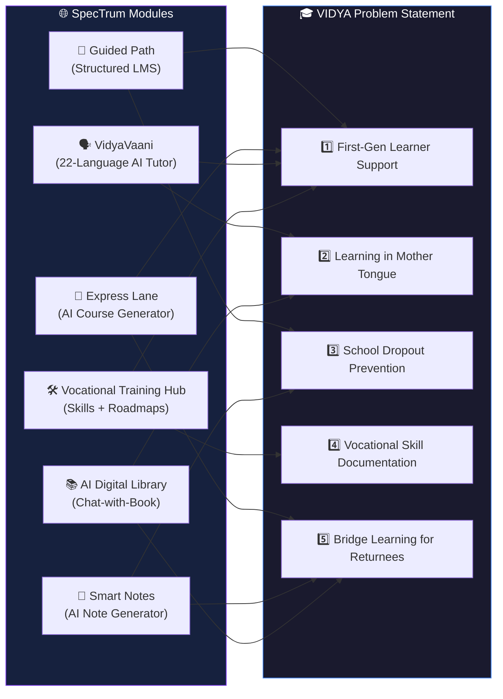
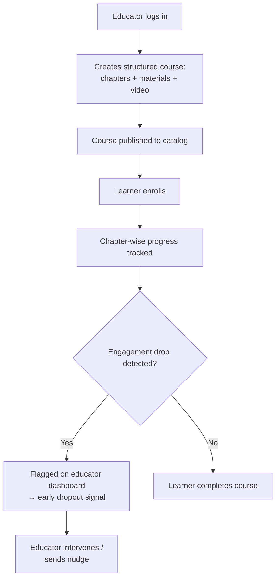
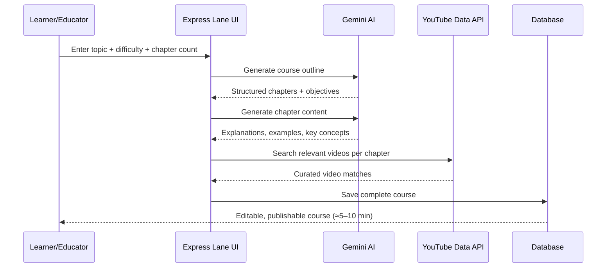
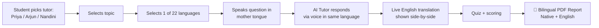
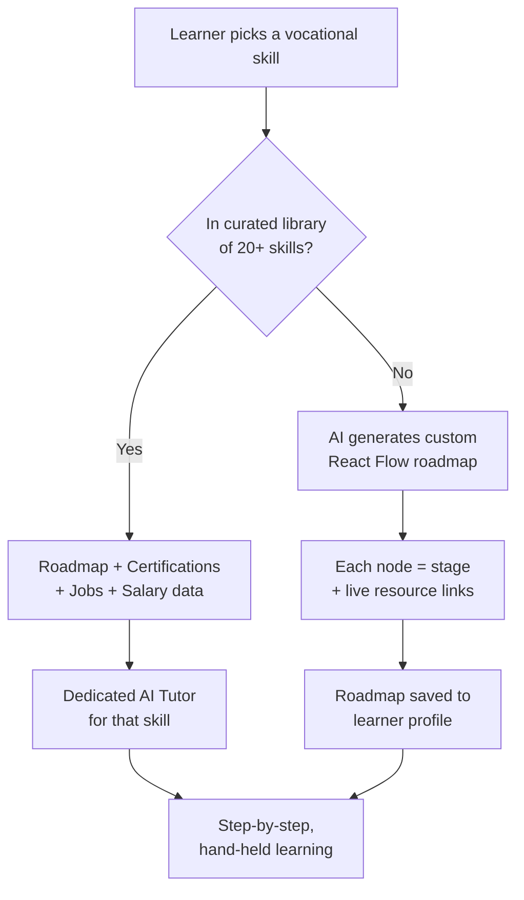
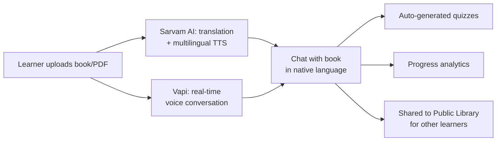
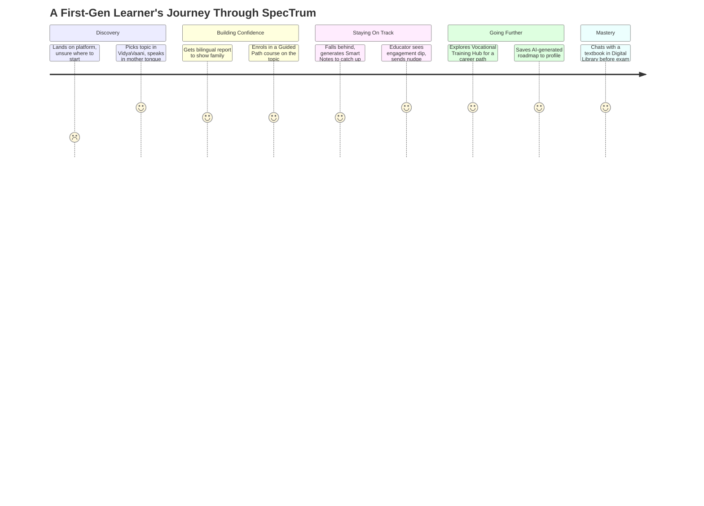
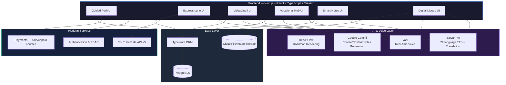

# 🌐 SpecTrum
### *सबका विद्या, सबकी भाषा — One Platform. Every Learner.*

**A unified AI + human learning ecosystem built for Build for Good: Bharat — VIDYA Track**

[Problem Statement](#-the-problem-statement-vidya) • [Our Thesis](#-our-thesis) • [Feature Map](#-feature--problem-mapping-at-a-glance) • [Modules](#-the-six-modules) • [Architecture](#️-system-architecture) • [Tech Stack](#-tech-stack) • [Team](#-team)

---

## 🎯 The Problem Statement: VIDYA

> **विद्या — Learning, Skilling & Educational Access — for first-generation learners and those the system forgot.**

The VIDYA track didn't ask for "an EdTech app." It asked for a response to five very specific, very human failure points in India's learning pipeline:

| # | Sub-problem | What's actually broken |
|---|---|---|
| 1 | **First-generation learner support** | No parent went to college. No one to ask "what now?" — academically or emotionally. |
| 2 | **Learning in mother tongue** | Millions learn best in a language the formal system simply doesn't teach in. |
| 3 | **School dropout prevention** | At-risk students are invisible until they're already gone. |
| 4 | **Vocational skill documentation** | Real, valuable skills exist — but they're invisible to the formal economy and to certification systems. |
| 5 | **Bridge learning for returnees** | Adults returning to education after years away are forced back to square one, regardless of what they already know. |

Most teams pick **one** of these and build a point solution. We didn't think that was good enough — because in the real world, *these five problems don't occur in isolation*. The same dropout-risk teenager might also be a first-gen learner who thinks better in Bhojpuri than English, and the same garage mechanic with 8 years of informal experience is also a "returnee" the moment he wants to formalize that knowledge into a certificate.

So we built **SpecTrum**: not five tools bolted together, but **one learning operating system** with six interlocking modules, each engineered against a specific edge of the VIDYA brief — and several of them solve more than one edge at once.

---

## 💡 Our Thesis

> **Access isn't one thing. It's language, structure, pace, recognition, and guidance — and a learner can be missing any combination of the five at any time.**

A learner who can't read English doesn't need a "translated PDF" — they need a tutor who *speaks* to them. A self-taught electrician doesn't need a course — he needs his 8 years of garage work turned into a credential. A 35-year-old returning to study after a decade doesn't need Chapter 1 again — she needs a system that knows what she already knows.

SpecTrum is built on **human expertise + AI scaffolding**, where:
- **Humans (educators)** provide structure, credibility, and accountability through **Guided Path**.
- **AI** removes every barrier that has historically excluded people from that structure — language, pace, invisibility, and lack of a starting point — through **VidyaVaani, Vocational Training Hub, Smart Notes, and the AI Digital Library**.

---

## 🧩 Feature → Problem Mapping (At a Glance)

| Module | 1️⃣ First-Gen | 2️⃣ Mother Tongue | 3️⃣ Dropout Prevention | 4️⃣ Vocational Docs | 5️⃣ Bridge/Returnee |
|---|:---:|:---:|:---:|:---:|:---:|
| 📘 Guided Path | ✅ | — | ✅ | — | — |
| 🚀 Express Lane | ✅ | — | — | — | ✅ |
| 🗣️ VidyaVaani | ✅ | ✅ | — | — | — |
| 🛠️ Vocational Training Hub | ✅ | — | — | ✅ | — |
| 📝 Smart Notes | — | — | ✅ | — | ✅ |
| 📚 AI Digital Library | — | ✅ | — | — | ✅ |

Every single sub-problem in the brief is covered by at least two independent modules. There is no single point of failure in our coverage of VIDYA.

---

## 🏗️ The Six Modules

### 1️⃣ Guided Path — *The Structured Backbone*

**Solves:** First-generation learner support · School dropout prevention

Guided Path is our full-scale, dual-dashboard LMS — the part of SpecTrum that looks and feels like a mature EdTech platform, because for first-gen learners, **structure itself is the missing resource.** A first-generation student doesn't just lack content — they lack the scaffolding of "how does formal learning even work, what comes after what, who do I ask."

- **Educator Dashboard**: Course authoring with chapter-wise structuring, lecture/study-material uploads, an inbuilt video player, and a payment layer for free or paid courses — letting verified educators package real expertise into something a first-gen learner can trust and follow start-to-finish.
- **Learner Dashboard**: Enrol, track progress chapter-by-chapter, and follow a *visible, finite path* rather than an open-ended pile of YouTube links — which matters enormously for someone with no family precedent for "how a course is supposed to go."
- **Completion & Engagement Analytics** for educators: enrolment counts, completion rates, and drop-off points per chapter — turning the **dropout problem from invisible to visible**. An educator can see exactly *where* students stall and intervene before a learner disappears entirely, which is the core failure mode the "school dropout prevention" sub-problem is about: at-risk learners go unnoticed until it's too late.

---

### 2️⃣ Express Lane — *AI Course Generation, On Demand*

**Solves:** First-generation learner support · Bridge learning for returnees

Express Lane is our AI-powered course generator, built on Next.js, Google Gemini, and the YouTube Data API. Where Guided Path depends on an educator having already authored a course, Express Lane closes the gap for **the topics no one has gotten around to writing yet** — which is exactly the situation a returnee or a first-gen learner is most often stuck in: a very specific need, and nothing pre-built for it.

- Pick a category and topic → Gemini generates a full course layout (chapters, learning objectives, structure) in under 30 seconds.
- Each chapter is auto-populated with detailed explanations, key concepts, and practical examples, then matched with relevant, vetted YouTube videos for visual learners.
- The entire pipeline — outline → content → video matching → save — takes 5–10 minutes, versus the weeks it normally takes an educator to build a course from scratch.
- Full editing layer afterward (drag-and-drop chapter reordering, rich-text content edits, custom banners) means an educator — or even an advanced learner — can shape the AI draft into something tailored to a specific first-gen or returnee audience, rather than a generic course.

This directly serves **bridge learners**: someone re-entering education after years away can type in exactly the gap they need filled ("Refresher: Algebra before starting a Data Analytics course") and get a tailored mini-course instantly, instead of being forced through a generic, ground-up curriculum that assumes they're starting from zero.

---

### 3️⃣ VidyaVaani (विद्यावाणी) — *सबकी भाषा में ज्ञान*

**Solves:** Learning in mother tongue · First-generation learner support

This is our most directly-named answer to the brief's mother-tongue sub-problem. VidyaVaani is a **voice-first AI tutor** available in **all 22 scheduled Indian languages** under the 8th Constitutional Schedule, plus English.

**How it works:**
1. Choose a tutor persona — Priya, Arjun, or Nandini.
2. Enter any topic — Maths, Science, History, or anything else.
3. Pick a language from Hindi, Bengali, Telugu, Marathi, Tamil, Gujarati, Kannada, Malayalam, Punjabi, Odia, Assamese, Urdu, Maithili, Sanskrit, Nepali, Konkani, Manipuri, Bodo, Dogri, Kashmiri, Santali, Sindhi, or English.
4. **Speak** to the tutor in your mother tongue and get a **spoken** answer back — not text you have to read in a script you might not be comfortable with.
5. A **real-time English translation** runs side-by-side, so the same session is useful to the learner *and* to a parent, teacher, or NGO worker checking in on progress.
6. A quiz at the end scores comprehension, and a **bilingual PDF report** (native language + English) is generated — something a first-gen learner can show a parent or counselor as proof of progress, in a language the *whole family* can read, not just the student.

This is also a first-gen support tool in disguise: the single biggest barrier for a first-generation learner is often not ability, it's **language anxiety** in formal instruction. Removing the English/Hindi-only gatekeeping from the *explanation itself* — not just the marketing material — is what makes the rest of the system usable for someone the system has historically forgotten.

---

### 4️⃣ Vocational Training Hub — *Making Invisible Skills Visible*

**Solves:** Vocational skill documentation · First-generation learner support

This module is our direct answer to the "skills that exist but are invisible to the formal economy" problem. It has two layers:

**Layer 1 — Curated Documentation (20+ vocational skills):** Categorized by domain (Tech, Finance, and more), each skill page lays out a complete roadmap, required certifications, available jobs, and realistic salary bands. This alone turns vague aspiration ("I want to learn plumbing" / "I want to get into Data Entry") into a concrete, navigable plan — which is exactly the kind of "no one to ask" gap a first-gen learner faces when there's no family precedent for *how a career in a trade or a tech skill is actually built*.

**Layer 2 — Dedicated AI Tutor per Skill:** Every single documented vocation comes with its own specially-tuned AI tutor that hand-holds a learner through that skill specifically, answering questions and guiding step-by-step — not a generic chatbot, but a subject-matter guide trained around that one trade.

**Layer 3 — Generative Roadmaps (React Flow):** If a learner wants a skill that *isn't* in the pre-built documentation, they can type it in, and AI generates a complete, visual, node-by-node roadmap using React Flow. Each node carries live learning resource links for that exact stage, and the entire roadmap is **saved to the learner's profile** so they can resume exactly where they left off — turning skill acquisition from a one-off search into a persistent, trackable journey.

This is also, quietly, the closest thing in our platform to solving the **"vocational and trade skill documentation"** problem from the source materials we were briefed against — where the real-world ask was tools like a *video-based skill portfolio builder* and an *RPL (Recognition of Prior Learning) assistant* that maps years of informal experience to NSQF certification pathways. Our roadmap + certification-mapping layer is a direct architectural step toward that: it tells an experienced-but-uncredentialed worker exactly which certifications their existing skill level maps to, and what's missing to get there.

---

### 5️⃣ Smart Notes — *Your Best Friend for Any Syllabus*

**Solves:** Bridge learning for returnees · School dropout prevention (re-engagement)

Smart Notes turns any input — typed topics, uploaded PDFs, or scanned textbook pages — into clean, structured, **diagrammatic** notes, downloadable as a PDF.

This is purpose-built for two of the hardest-to-serve learner types in the brief:
- **Returnees**, who often don't need a full course re-run — they need a fast, structured *refresher* on exactly the syllabus section they're behind on, so they can re-enter at the right level instead of from zero.
- **Distant or at-risk learners** (a category that overlaps heavily with dropout-prone students) who may have missed classes or lack consistent access to a teacher — Smart Notes lets them self-serve a complete, structured explanation of a missed topic on demand, lowering the chance that one missed week snowballs into disengagement and eventual dropout.

---

### 6️⃣ AI-Powered Digital Library — *Chat With Any Book, In Any Language*

**Solves:** Learning in mother tongue · Bridge learning for returnees

The Digital Library lets a learner upload a book and then **talk to it** — via chat or live voice — to understand any concept inside it, in any of the 22 supported Indian languages, powered by Sarvam AI for multilingual TTS and translation, and Vapi for real-time conversational voice.

- **22-language support** extends the mother-tongue promise of VidyaVaani to *any arbitrary book or text* a learner brings to the platform — not just our pre-built tutor content.
- **Auto quiz generation** turns passive reading into active recall, particularly valuable for competitive-exam aspirants (UPSC/JEE/NEET/B.Tech).
- **Progress tracking + gamified analytics** give returnees and bridge learners a clear sense of how much of a dense, possibly years-old textbook they've actually internalized.
- **Public library / community sharing** means one learner's uploaded and annotated book becomes a resource for the next person in the same position — compounding access over time rather than each learner starting from a blank page.

---

## 🗺️ How a Real Learner Moves Through SpecTrum

---

## ⚙️ System Architecture

---

## 🛠️ Tech Stack

| Layer | Technology |
|---|---|
| **Framework** | Next.js 16 (App Router), React, TypeScript |
| **Styling** | TailwindCSS, Shadcn UI |
| **AI — Content & Reasoning** | Google Gemini API |
| **AI — Multilingual Voice** | Sarvam AI (22-language TTS & translation) |
| **AI — Conversational Voice** | Vapi |
| **Roadmap Visualization** | React Flow |
| **Video Discovery** | YouTube Data API v3 |
| **Database** | PostgreSQL with a type-safe ORM layer |
| **Auth** | Session-based authentication with role-based access (Educator / Learner) |
| **Payments** | Integrated paid/unpaid course checkout |
| **Forms & Validation** | React Hook Form + Zod |

---

## 🌟 Why SpecTrum Wins on the VIDYA Brief

- **Full-spectrum coverage, not a point solution.** Every sub-problem in the VIDYA brief is addressed by at least two modules, so the system has no single point of failure against the rubric.
- **Human + AI, not human *or* AI.** Guided Path keeps real educators and real accountability in the loop; AI removes the access barriers (language, pace, invisibility) around that human core — rather than trying to replace it.
- **Built for the learner the system forgot, specifically.** Voice-first, mother-tongue-first design in VidyaVaani and the Digital Library isn't a feature toggle — it's the default interaction model, because for a huge share of first-gen learners, reading fluently in English or Hindi is itself the barrier, not the content.
- **Skill recognition, not just skill teaching.** The Vocational Training Hub doesn't stop at "here's how to learn X" — it connects existing informal experience to certification pathways and real job/salary data, addressing the *documentation* half of the vocational problem, not just the *learning* half.
- **Designed for re-entry, not just entry.** Smart Notes and Express Lane both assume a learner might be picking up mid-syllabus or after a long gap — a deliberately different default from most EdTech platforms, which assume a linear, uninterrupted learner.

---

## 🤝 Team

| Name | Role | LinkedIn |
|---|---|---|
| **Aprajita Ranjan** | Team Lead | [linkedin.com/in/aprajita-ranjan-961a0523b](https://www.linkedin.com/in/aprajita-ranjan-961a0523b/) |
| **Priyanshu Paul** | Member | [linkedin.com/in/priyanshu-paul-59221228a](https://www.linkedin.com/in/priyanshu-paul-59221228a/) |

---

Built with ❤️ for **Build for Good: Bharat — VIDYA Track**

*सबका विद्या, सबकी भाषा।*

⭐ **Star this repository if you believe access to learning shouldn't depend on which language you dream in.**

